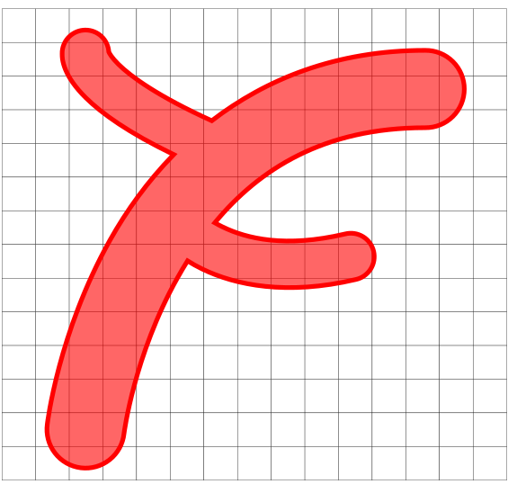

<a id="readme-top"></a>
<!--
README Template from: https://github.com/othneildrew/Best-README-Template
-->

<!-- PROJECT LOGO -->
<br />
<div align="center">
  <a>
    
  </a>

  <h3 align="center">Vessel Voxelizer</h3>

  <p align="center">
    GPU accelerated (fuzzy) voxelization of vascular structures
    <br />
    <a href="https://github.com/othneildrew/Best-README-Template"><strong>Explore the docs »</strong></a>
    <br />
    <br />
    <a href="https://github.com/othneildrew/Best-README-Template">View Demo</a>
    ·
    <a href="https://github.com/othneildrew/Best-README-Template/issues/new?labels=bug&template=bug-report---.md">Report Bug</a>
    ·
    <a href="https://github.com/othneildrew/Best-README-Template/issues/new?labels=enhancement&template=feature-request---.md">Request Feature</a>
  </p>
</div>


<!-- TABLE OF CONTENTS -->
<details>
  <summary>Table of Contents</summary>
  <ol>
    <li>
      <a href="#about-the-project">About The Project</a>
    </li>
    <li>
      <a href="#getting-started">Getting Started</a>
      <ul>
        <li><a href="#prerequisites">Prerequisites</a></li>
        <li><a href="#installation">Installation</a></li>
      </ul>
    </li>
    <li><a href="#usage">Usage</a></li>
    <li><a href="#license">License</a></li>
    <li><a href="#contact">Contact</a></li>
    <li><a href="#acknowledgments">Acknowledgments</a></li>
  </ol>
</details>


<!-- ABOUT THE PROJECT -->
## About The Project


<!-- GETTING STARTED -->
## Getting Started

### Prerequisites

### Installation

- install cupy based on your CUDA version
```bash
# for CUDA 11.x
pip install cupy-cuda11x

# for CUDA 12.x
pip install cupy-cuda12x
```

- compile and install the package
```bash
pip install .
```

<!-- USAGE EXAMPLES -->
## Usage


<!-- LICENSE -->
## License

Distributed under the MIT License. See `LICENSE.txt` for more information.

<p align="right">(<a href="#readme-top">back to top</a>)</p>


<!-- CONTACT -->
## Contact


<!-- ACKNOWLEDGMENTS -->
## Acknowledgments


