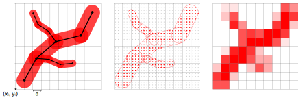

<a id="readme-top"></a>
<!--
README Template from: https://github.com/othneildrew/Best-README-Template
-->

<!-- PROJECT LOGO -->
<br />
<div align="center">
  <a>
    
  </a>

  <h3 align="center">Vessel Voxelizer</h3>

  <p align="center">
    GPU accelerated (fuzzy) voxelization of vascular structures
    <br /><br />
    <a href="example/example.ipynb">Demo</a>
    ·
    <a href="https://github.com/faberno/vessel_voxelizer/issues">Report Bug / Request Feature</a>
    ·
    <a href="#documentation">Documentation</a>
  </p>
</div>


<!-- TABLE OF CONTENTS -->
<details>
  <summary>Table of Contents</summary>
  <ol>
    <li>
      <a href="#about-the-project">About The Project</a>
    </li>
    <li>
      <a href="#getting-started">Getting Started</a>
      <ul>
        <li><a href="#prerequisites">Prerequisites</a></li>
        <li><a href="#installation">Installation</a></li>
      </ul>
    </li>
    <li>
      <a href="#documentation">Documentation</a>
      <ul>
        <li><a href="#how it works">How it works</a></li>
        <li><a href="#API">Installation</a></li>
        <li><a href="#API">Example</a></li>
      </ul>
    </li>
    <li><a href="#license">License</a></li>
    <li><a href="#acknowledgments">Acknowledgments</a></li>
  </ol>
</details>


<!-- ABOUT THE PROJECT -->
## About The Project
`vessel-voxelizer` is a CUDA-accelerated tool designed to convert vascular structures, defined by line segments with associated radii, into fuzzy voxel volumes, where
each voxel's value represents the fraction of its volume occupied by the vessels. This fuzzy representation is essential for simulations where the volume fraction plays 
a critical role in assigning the correct parameters to each voxel, ensuring precise modeling of e.g. physical processes. 
The project leverages CUDA for high performance and includes Python bindings for seamless integration into existing workflows.

<!-- GETTING STARTED -->
## Getting Started

### Prerequisites
- a CUDA-capable GPU

### Installation
1) install from pip 
```bash
pip install vessel_voxelizer
```
or clone the repository
```bash
git clone https://github.com/faberno/vessel_voxelizer.git
cd vessel_voxelizer
pip install .
```
2) make sure you have a cuda-capable array library installed (currently cupy and torch are supported)
- how to install cupy: https://docs.cupy.dev/en/stable/install.html
- how to install pytorch: https://pytorch.org/get-started/locally/#start-locally


<!-- USAGE EXAMPLES -->
## Documentation

### How it works

<div align="center">
  <a>
    
  </a>
</div>
A vessel segment V<sup>i</sup> is represented by a startpoint p<sub>0</sub><sup>i</sup>, an endpoint p<sub>1</sub><sup>i</sup> and a radius r<sup>i</sup>.
We determine the value of a voxel by supersampling K<sup>3</sup> points within it and checking how many of those points lie within the radius of the vessel (no points -> 0.0, all points -> 1.0). Currently K is chosen as 10, so 1000 points per voxel are checked.<br>
To avoid unnecessary checks of voxels that lie far away from any vessel, an initial bounding box intersection check is performed.

### API
The voxelization is run by the function `voxelize`. It requires:
- `volume`: The volume that is written to
- `volume_origin`: origin coordinates (x<sub>0</sub>, y<sub>0</sub>, z<sub>0</sub>) of the volume  ( (x<sub>0</sub>, y<sub>0</sub>) in figure)
- `volume_spacing`: voxel side length (d in figure)
- `vessel_positions`: list of all vessel segments ((p<sub>0</sub><sup>0</sup>, p<sub>1</sub><sup>0</sup>), ..., (p<sub>0</sub><sup>N</sup>, p<sub>1</sub><sup>N</sup>))
- `vessel_radii`: list of all vessel radii

The array parameters should lie on the GPU, either as a `cupy.ndarray` or `torch.Tensor`.

### Example
For a full example, take a look at the following [notebook](example/example.ipynb).

<!-- LICENSE -->
## License

Distributed under the MIT License. See `LICENSE.txt` for more information.

<p align="right">(<a href="#readme-top">back to top</a>)</p>

## TODO
- make number of sample points adaptable
- add prebuilt wheels

<p align="right">(<a href="#readme-top">back to top</a>)</p>

<!-- ACKNOWLEDGMENTS -->
## Acknowledgments
- the bindings are created using `nanobind` (https://nanobind.readthedocs.io/en/latest/index.html)
